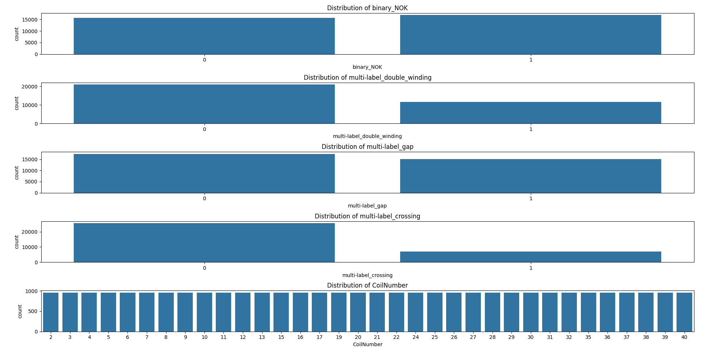
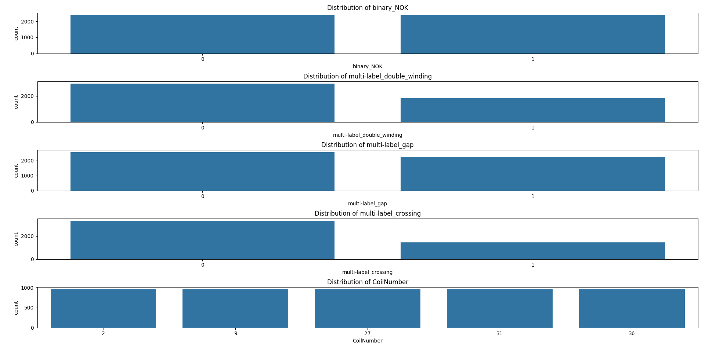

# Self-Supervised Learning with Barlow Twins and Multi-label Classification Optimization

This project implements self-supervised learning techniques, specifically using the Barlow Twins method. The implementation leverages the Lightly SSL package for the Barlow Twins model, with the official implementation available in `barlowtwins.py` and `meta.py`.

The second step involves downstreaming the Barlow feature extractor for multi-label classification purposes. To optimize the hyperparameters and the architecture of the classifier model, we use Optuna. Optuna is also used for selecting other hyperparameters such as the optimization function and learning rate. Customized early stopping in Optuna is implemented for efficient training.
## Data Split
-[x] Split the train and validation so one coil is only assigned to one datatype
-[x] 
-[x]
-[x]
-[x]

## Progress Checklist

- [x] Training the Barlow Twins on a customized model
- [x] Optimizing the hyperparameters with Optuna
- [x] Training the multi-label classifier on Barlow Twins
- [x] Impletementated the state of the art Dino Paper Meta
- [ ] Address the data leakage problem (in progress)

## Key Concepts

- **Self-Supervised Learning**: An unsupervised machine learning method where the data provides the supervision.
- **Barlow Twins**: A self-supervised learning method that learns representations by making similar images look alike.
- **Lightly SSL**: A Python package that provides tools for self-supervised learning.
- **Downstreaming**: The process of using learned representations for a specific task.
- **Multi-label Classification**: A type of classification where each sample can belong to multiple classes.
- **Optuna**: An open-source hyperparameter optimization framework.
- **Early Stopping**: A method to prevent overfitting by stopping the training process early if the model's performance stops improving on a hold out validation dataset.-
## Results

